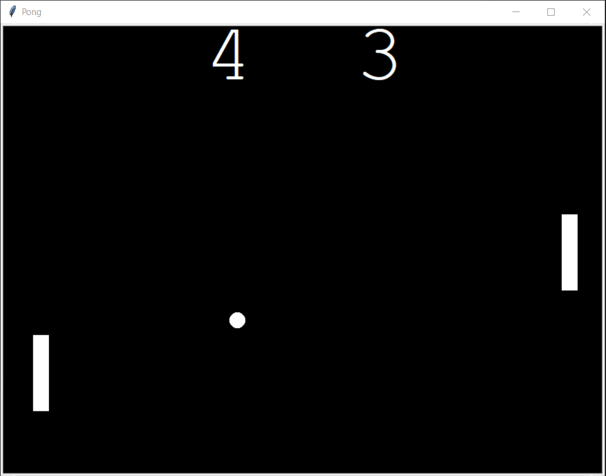

# Pong Game
Pong is a table tennis–themed arcade sports video game, featuring simple two-dimensional graphics

Created Pong game using Python and Turtle Graphics.

Concepts that are used:
* Loops
* If-else condition
* Functions
* Few OOPs concept like Class, Inheritance
* Turtle Graphics Library
* Dunder method

